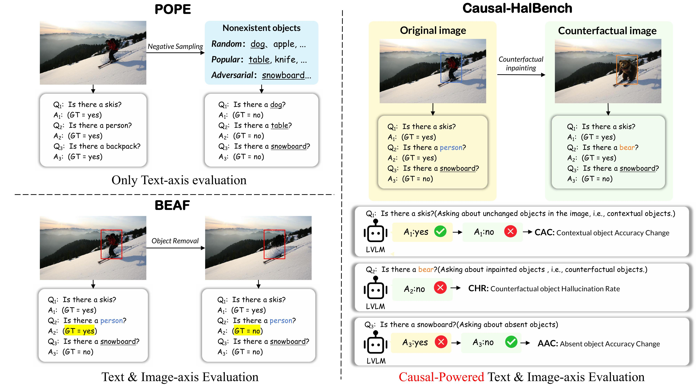

# Causal-HalBench: Uncovering LVLMs Object Hallucinations Through Causal Intervention(AAAI 2026)



This repository is official implementation for our paper: [Causal-HalBench: Uncovering LVLMs Object Hallucinations Through Causal Intervention(AAAI 2026)](https://arxiv.org/abs/2511.10268)

<br>

> **Abstract:** *Large Vision-Language Models (LVLMs) often suffer from object hallucination, making erroneous judgments about the presence of objects in images. We propose this primarily stems from spurious correlations arising when models strongly associate highly co-occurring objects during training, leading to hallucinated objects influenced by visual context. Current benchmarks mainly focus on hallucination detection but lack a formal characterization and quantitative evaluation of spurious correlations in LVLMs. To address this, we introduce causal analysis into the object recognition scenario of LVLMs, establishing a Structural Causal Model (SCM). Utilizing the language of causality, we formally define spurious correlations arising from co-occurrence bias. To quantify the influence induced by these spurious correlations, we develop Causal-HalBench, a benchmark specifically constructed with counterfactual samples and integrated with comprehensive causal metrics designed to assess model robustness against spurious correlations. Concurrently, we propose an extensible pipeline for the construction of these counterfactual samples, leveraging the capabilities of proprietary LVLMs and Text-to-Image (T2I) models for their generation. Our evaluations on mainstream LVLMs using Causal-HalBench demonstrate these models exhibit susceptibility to spurious correlations, albeit to varying extents.*


## Evaluation 
### 1. Causal-HalBench dataset download
- Causal-HalBench dataset: download from [here](https://drive.google.com/file/d/1kMTzO4vXVi66Wngvhqrs1Z82vffPyVAt/view?usp=sharing)
- The original images are sourced from the [COCO dataset](https://cocodataset.org/#home)

### 2. Get your model's answer
- Image name, question, GT answers, and additional metadata are in `./qa.json` file
- The model output should be organized in a json file in the following format:
  ```bash
  [
    {
        "image_name": "COCO_val2014_000000001171.jpg",
        "type": "target",
        "answer": "yes",
        "tag": "origin",
        "id": 0
    },
    {
        "image_name": "COCO_val2014_000000001171.jpg",
        "type": "absent",
        "answer": "no",
        "tag": "origin",
        "id": 1
    },
    ...
    {
        "image_name": "COCO_val2014_000000580294_001.jpg",
        "type": "absent",
        "answer": "no",
        "tag": "inpainted",
        "id": 9708
    }
  ]
  ```
- You can refer to the code in the `./inference` folder to generate answers.

### 3. Evaluation
- Compute our casual-based metrics (CAC, AAC, CHR)
- Configure the model response file (`resp_file`) and QA file (`qa_file`) in `./metric.py`, then run the code.

## Run the pipeline 
- Install the environment according to `./requirements.txt`
- run `./pipeline/Casual-HalBench_pipeline.py` to perform image editing.


## Citation
If you use Causal-HalBench in a research paper, please cite our work and related works as follows:
````BibTeX
@inproceedings{xu2026causal,
  title={Causal-HalBench: Uncovering LVLMs Object Hallucinations Through Causal Intervention},
  author={Xu, Zhe and Wang, Zhicai and Wu, Junkang and Lu, Jinda and Wang, Xiang},
  booktitle={Proceedings of the AAAI Conference on Artificial Intelligence},
  volume={40},
  number={40},
  pages={34169--34177},
  year={2026}
}

@inproceedings{lin2014microsoft,
  title     = {Microsoft coco: Common objects in context},
  author    = {Lin, Tsung-Yi and Maire, Michael and Belongie, Serge and Hays, James and Perona, Pietro and Ramanan, Deva and Doll{'a}r, Piotr and Zitnick, C Lawrence},
  booktitle = {European Conference on Computer Vision (ECCV)},
  year      = {2014},
}

@inproceedings{Li-hallucination-2023,
  title     = {Evaluating Object Hallucination in Large Vision-Language Models},
  author    = {Yifan Li, Yifan Du, Kun Zhou, Jinpeng Wang, Wayne Xin Zhao and Ji-Rong Wen},
  booktitle = {The 2023 Conference on Empirical Methods in Natural Language Processing},
  year      = {2023},
}
````
